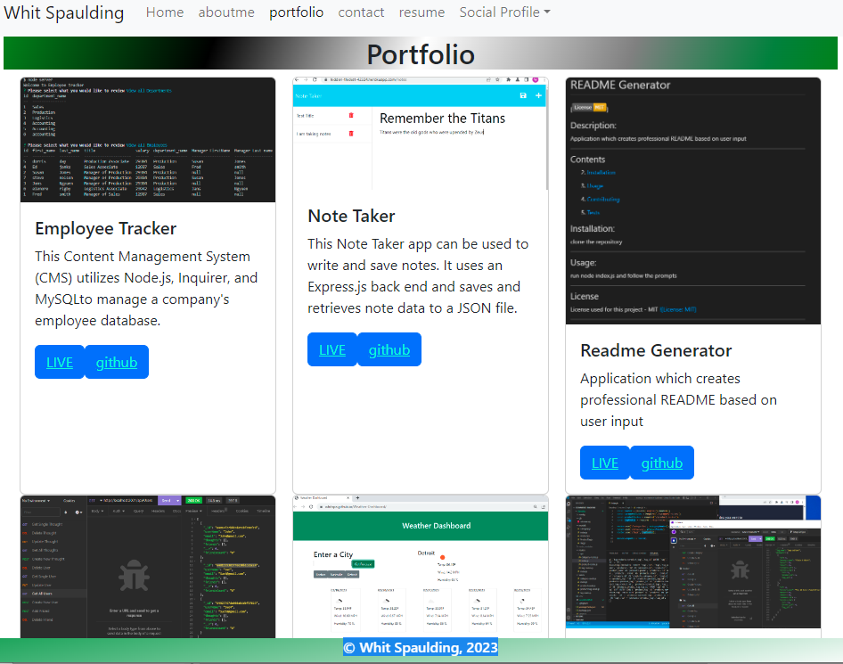

# Portfolio

 []
 
 ## Description:
 This portfolio displays some of my work during my progression to full stack web developer. React, HTML,CSS, Bootstrap and Javascript were key tools for the construction of this single-page app.

## Contents
  
  
  2. [Installation](#installation)
  
  3. [Usage](#usage)
  
  4. [Contributing](#contributing)
  
  5. [Tests](#tests)
  
  
## Installation:
  
  clone the repository
  
  ---
  
## Usage:
 
 To utilize the portfolio: Go to VScode. "npm i" and then "npm start" runs the app in development mode.
 Open [http://localhost:3000](http://localhost:3000) to view it in your browser.
  ---
 
  ## License
  
  License used for this project - MIT
  [![License: MIT]](https://opensource.org/licenses/MIT)
  
  ---
  
  ## Contributing:
  
  Please follow these instructions to contribute to the project:
  create pull request from seperate branch and await approval
  
  ---
  
  ## Tests:
  
   `npm test` Launches the test runner in the interactive watch mode.\
    See the section about [running tests](https://facebook.github.io/create-react-app/docs/running-tests) for more information.

  
  ---
  
 ## Questions
  
  * GitHub Username: WSCoding
  * Link to Github user profile: github.com/whitspa
  * Email Address: whitspa64@duck.com

## Link to the deployed application
https://whitspa.github.io/portfolio/
  
 
  A screen shot of the application is below:

